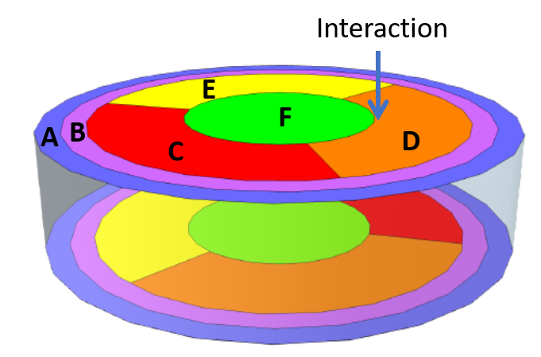
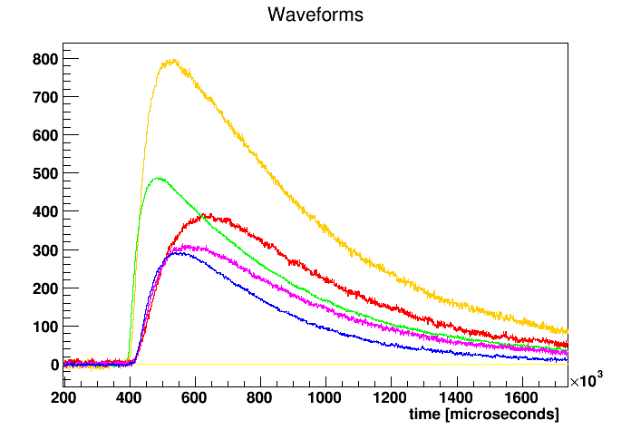
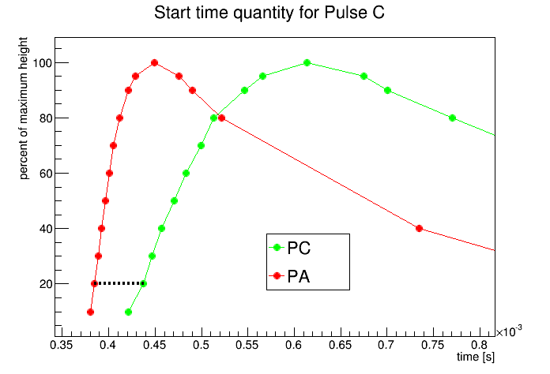
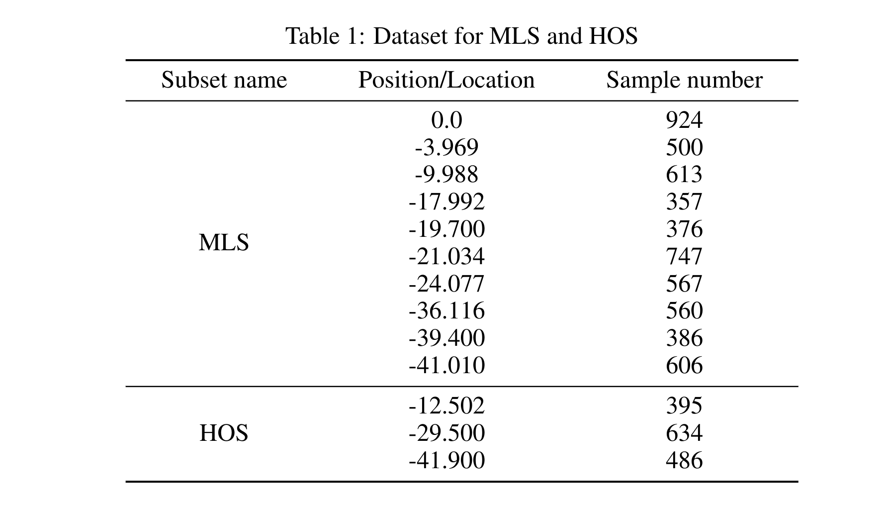
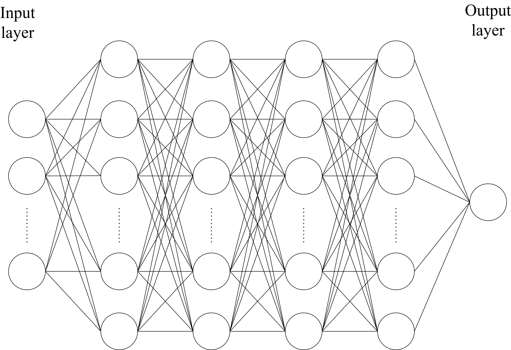

# Welcome to FAIR-UMN-CDMS

Welcome!

This is the project web-page for our project---FAIR-UMN-CDMS: Identifying Interaction Location in SuperCDMS Detectors.

In this project, we address the problem of accurately reconstruct the locations of interactions in theSuperCDMS detectors using machine learning methods. The approach is to use data collected with aradioactive source at known locations to train and qualify machine learning models.

## Detector and Its Data 

### Detector Information

A prototype SuperCDMS germanium detector was tested at the University of Minnesota with a radioactive source mounted on a movable stage that can scan from the edge to the center of the detector. The detector is disk-shaped with sensors placed on the top and bottom surfaces to detect the particles emitted by the radioactive source, which is shown in [Figure 1](https://).

<figure></figure>
 
<figcaption>Figure 1: A SuperCDMS dark matter detector.</figcaption>

The sensors measure phonons (quantized vibrations of the crystal lattice) that are produced by the interacting particle and travel from the interaction location to the sensors. The number of phonons and the relative time of arrival at a particular sensor depends on the positions of the interaction and
the sensor. The sensors are grouped into six regions on each side of the detector and each of these “channels” produces a waveform for every interaction. For the test performed at Minnesota, five channels on one side of the detector were used ([Figure 2](https://)). The movable radioactive source was used to produce interactions at thirteen different locations on the detector along a radial path from the central axis to close to the the detector’s outer edge ([Figure 3](https://)).

<figure></figure>
  
<figcaption>Figure 2: Pulses from an interaction in a SuperCDMS detector.</figcaption>

 

<figure></figure>
 
<figcaption>Figure 3: nteraction locations included in the dataset.</figcaption>

### Data from the Detector
For each interaction a set of parameters was extracted from the signals from each of the five sensors. These parameters represent information known to be sensitive to interaction location, including the relative timing between pulses in different channels, and features like the pulse shape. The relative
amplitudes of the pulses are also relevant but due to instabilities in amplification during the test this data is not included. The parameters included for each interaction are illustrated in [Figure 4](https://) and also see our [document](https://github.com/FAIR-UMN/FAIR-UMN-CDMS/blob/main/doc/FAIR%20Document%20-%20Identifying%20Interaction%20Location%20in%20SuperCDMS%20Detectors.pdf) for details.

<figure></figure>
  
<figcaption>Figure 4: Pulses timing and shape parameters.</figcaption>

## Machine Learning Solution

### Dataset for Machine Learning
We need to a large number of (x,y) paris to train our machine learning model. In our current experimental data, we have 19 informative features extracted
from 5 observed signals (pulses) and 13 different interaction locations (see our [document](https://github.com/FAIR-UMN/FAIR-UMN-CDMS/blob/main/doc/FAIR%20Document%20-%20Identifying%20Interaction%20Location%20in%20SuperCDMS%20Detectors.pdf) for details). In total, we obtain 7151 (x, y) pairs, of which the details are shown in [Table 1](https://). We further split our dateset to *Model-learning subset (MLS)* and *Held-out subset (HOS)*, of which the detailed definitions are provided in our [document](https://github.com/FAIR-UMN/FAIR-UMN-CDMS/blob/main/doc/FAIR%20Document%20-%20Identifying%20Interaction%20Location%20in%20SuperCDMS%20Detectors.pdf).

<figure></figure>
  

### Deep Neural Network Model
We implement our neural network with Pytorch 1.9.0 3 . The framework of our neural network model is shown in [Figure 5](https://). It is a fully-connected network with non-linearity activation functions. In particular, in each hidden layer except the output layer, we employ a linear layer followed by the batch normalization, leaky rectified activation, and dropout. For the output layer, we simply pass the learned features through a linear layer and obtain its prediction directly. For other settings, please refer to our [document](https://github.com/FAIR-UMN/FAIR-UMN-CDMS/blob/main/doc/FAIR%20Document%20-%20Identifying%20Interaction%20Location%20in%20SuperCDMS%20Detectors.pdf).

<figure></figure>
  
<figcaption>Figure 5: The framework of deep neural network models.</figcaption>

### Results of Deep Neural Network Models

We show the test performance on our test set (held-out subset) in [Table 2](https://). We can observe that simply increasing the model complexity does not boost the performance on our dataset, rather it hurts the performance. Therefore, we argue that to achieve better performance, it is worth exploring novel network architectures or training paradigms. For more experimental results, please refer to our [document](https://github.com/FAIR-UMN/FAIR-UMN-CDMS/blob/main/doc/FAIR%20Document%20-%20Identifying%20Interaction%20Location%20in%20SuperCDMS%20Detectors.pdf).

<figure></figure>
  

## Support or Contact

Having trouble with codes or setting up? Check out our [documentation](https://github.com/FAIR-UMN/FAIR-UMN-CDMS/blob/main/doc/FAIR%20Document%20-%20Identifying%20Interaction%20Location%20in%20SuperCDMS%20Detectors.pdf) or [contact support](https://) and we’ll help you sort it out.
